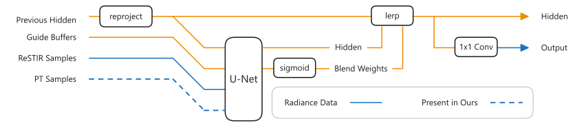

# Neural Denoising under Correlated Noise from ReSTIR Path Tracing

Code for the master's thesis
[*Neural Denoising under Correlated Noise from ReSTIR Path Tracing*](https://urn.fi/URN:NBN:fi:aalto-202606175267)
(Aapo Pajunen, Aalto University, 2026).

ReSTIR reuses path samples across neighbouring pixels and frames, which makes
its output far less noisy than plain path tracing but leaves correlated noise
that a denoiser struggles to tell apart from scene detail. The thesis studies
whether giving a neural denoiser the raw 1-sample-per-pixel path-traced
estimates that seed ReSTIR's resampling, whose noise is uncorrelated, reduces
these correlation artefacts. The denoiser is a recurrent network built on the
magnitude-preserving U-Net of EDM2
([Karras et al., CVPR 2024](https://arxiv.org/abs/2312.02696)), and this
repository is a modified fork of the
[official EDM2 implementation](https://github.com/NVlabs/edm2).

## Model



*Architecture overview (Figure 8 in the thesis).*

[`RecurrentDenoiser`](training/networks_edm2.py) is a recurrent denoiser built
on EDM2's magnitude-preserving U-Net. It carries a learned hidden state from
frame to frame: each frame the previous state is reprojected into the current
view, the U-Net combines it with the current frame's inputs, and a predicted
per-pixel blend weight decides how much history to keep. It is trained on
32-frame sequences with an L1 loss on the output and on its frame-to-frame
change. See the [thesis](https://urn.fi/URN:NBN:fi:aalto-202606175267) for details.

The thesis compares two input configurations, each in a recurrent and a
feed-forward variant:

| Inputs | Thesis name |
|---|---|
| depth, diffuse albedo, normal, ReSTIR (correlated) | Baseline |
| the above + the 1 spp path-traced initial candidates (`restir_uncorrelated`) | Ours |

The feed-forward variant is the same network trained with `"use_history": false`:
the hidden state is not carried between frames, so every frame starts from an
empty history.

Currently only the recurrent Baseline configuration is included
([`configs/thesis_restir.json`](configs/thesis_restir.json)), with values taken
from the launch script used for the thesis runs. The configurations of the
other three models will be added once they have been verified against the
original training runs.

The recurrent thesis results use the EMA snapshots with `std = 0.001` (files ending in `-0.001.pkl`).

## Data

Unfortunately, the trained model weights and the training data are not
currently available. This section documents the dataset format the code
expects.

Datasets are HDF5 files, one per scene and split. Each run's config names the
files relative to a data root, which is given with `--data-root` or the
`DENOISE_DATA_ROOT` environment variable.

A `dataset.hdf5` contains:

| Entry | Contents |
|---|---|
| `buffers` | float16 `[sequences, frames, channels, H, W]`, all per-pixel buffers stacked along the channel axis |
| `cameras` | structured array `[sequences, frames]` with fields `position`, `target`, `up`, `focalLength`, `aspectRatio`, `nearPlane`, `farPlane` |
| `crop_sequences` | `[crop sizes, sequences, frames]` of `(top, left)`; needed for training and validation (crop 128) |
| `attrs['buffer_mapping']` | Python-literal dict `{buffer name: [channel indices]}` |
| `attrs['crop_sizes']` | Python-literal list of crop sizes in `crop_sequences` |
| `attrs['mean_radiance']` | optional, see below |

Buffers used by the model: `depth`, `diffuse`, `normal`, `restir_correlated`,
`restir_uncorrelated`, `target` (reference), `motion_vector` (in UV units) and
`world_space` (world-space position).

Radiance buffers are divided by a per-scene mean radiance so scenes share a
common exposure. The value is taken from the file's `mean_radiance` attribute
if present, otherwise from `SCENE_MEAN_RADIANCE` in
[`training/dataset.py`](training/dataset.py) (the values used for the thesis
scenes), otherwise 1.0. All outputs of the model are in these normalized units.

The datasets were rendered with a separate Falcor-based pipeline that is not
part of this repository.

## Repository layout

```
train.py                 training entry point
validate.py              validation loss for all snapshots of a run
select_best.py           pick checkpoints from validation results
denoise.py               run a snapshot over test sequences
compute_metrics.py       image metrics for denoised sequences
configs/                 thesis training configuration(s)
docs/                    architecture diagram
training/networks_edm2.py  U-Net and the recurrent denoiser
training/loss.py         recurrent L1 loss
training/dataset.py      HDF5 sequence dataset
training/augmentation.py brightness, channel shuffle and flip augmentations
training/training_loop.py  training loop with truncated BPTT
training/phema.py        power-function EMA (from EDM2)
torch_utils/, dnnlib/    utilities (from EDM2, extended)
```

## License

This work is a derivative of EDM2 and is distributed under the same
[Creative Commons BY-NC-SA 4.0](LICENSE.txt) license: non-commercial use
only, and derivatives must be shared under the same terms. Files carrying the
NVIDIA copyright header originate from EDM2 and have been modified.

Copyright (c) 2024, NVIDIA CORPORATION & AFFILIATES. Modifications (c) 2025–2026 Aapo Pajunen.

## Citation

If you use this code, please cite the thesis and EDM2:

```bibtex
@mastersthesis{Pajunen2026denoising,
  title  = {Neural Denoising under Correlated Noise from {ReSTIR} Path Tracing},
  author = {Aapo Pajunen},
  school = {Aalto University, School of Science},
  year   = {2026},
  url    = {https://urn.fi/URN:NBN:fi:aalto-202606175267},
}

@inproceedings{Karras2024edm2,
  title     = {Analyzing and Improving the Training Dynamics of Diffusion Models},
  author    = {Tero Karras and Miika Aittala and Jaakko Lehtinen and
               Janne Hellsten and Timo Aila and Samuli Laine},
  booktitle = {Proc. CVPR},
  year      = {2024},
}
```
